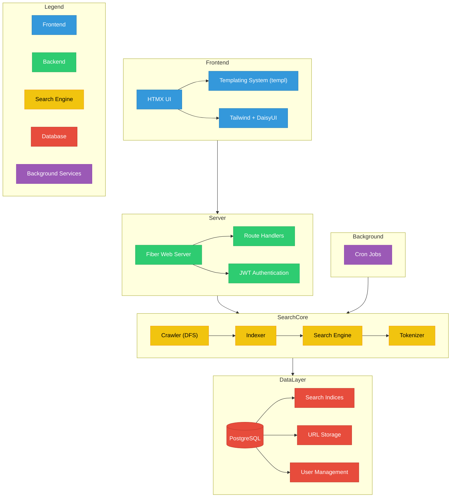

# Notes
Using htmx, tailwindcss and daisyui from CDN

# How to search
`http://127.0.0.1:port/search` body of `{"term": "term goes here"}`

# Backend
* go
* fiber
* htmx
* cron
* postgresql

# Frontend
* templ
* air for live reload: `air`
  * useful for building with templ
* daisyui
* tailwindcss

# Crawler
Uses DFS algorithms to scan and save URLs and metadata from the internet

# Indexer
Implements url indexing 
